# Architectural Overview — moa-portfolio

This document provides a comprehensive technical overview of the software architecture, design patterns, and engineering decisions implemented in the `moa-portfolio` project.

---

## 🏛️ Core Architecture Paradigm

The `moa-portfolio` project is a modern, high-performance, single-page interactive portfolio website built on a **Component-Driven Client-Only Architecture**. 

The design is 100% custom-tailored, intentionally avoiding commercial UI kits (like MUI, Chakra, or shadcn/ui) to ensure absolute control over styling footprint, bundle size, and design fidelity.

```mermaid
graph TD
    App[src/App.jsx] --> Layout[Layout Components]
    App --> Sections[Page Sections]
    App --> UI_Global[Global UI Utilities]

    Layout --> Navbar[src/components/layout/Navbar.jsx]
    Layout --> Footer[src/components/layout/Footer.jsx]

    Sections --> Hero[src/components/sections/Hero.jsx]
    Sections --> About[src/components/sections/About.jsx]
    Sections --> Projects[src/components/sections/Projects.jsx]
    Sections --> Skills[src/components/sections/Skills.jsx]
    Sections --> Experience[src/components/sections/Experience.jsx]
    Sections --> Contact[src/components/sections/Contact.jsx]

    UI_Global --> Cursor[src/components/ui/CustomCursor.jsx]
    UI_Global --> ScrollProg[src/components/ui/ScrollProgress.jsx]

    Sections -.-> StaticData[(src/data/)]
    Sections -.-> Hooks[src/hooks/]
    Sections -.-> Styles[src/styles/]
```

### 1. Functional React Component Pattern
*   **Functional Components with Hooks**: All components are structured as functional React components. There are no legacy class components.
*   **Single File Responsibility**: Each component resides in its own file (e.g., `src/components/ui/ProjectCard.jsx`), following a strict modular hierarchy.
*   **Size Constraint**: Component files are kept compact (maximum ~150 lines target, excluding data maps) to make them highly readable and maintainable.
*   **Strict Import Order Hierarchy**:
    1. React core and hooks (`useState`, `useEffect`, `useRef`)
    2. External animation & icon libraries (`framer-motion`, `lucide-react`, `react-icons`)
    3. Shared UI components (`src/components/ui/...`)
    4. Static data models (`src/data/...`)
    5. Styling definitions and utilities

### 2. State Management Strategy
Because the site is a Single Page Application (SPA) with localized interactions, global state libraries (like Redux or Zustand) are intentionally avoided. Instead, the application relies on:
*   **Component-Local State (`useState`)**: Used for interactive triggers, dynamic list filters, mobile drawer states, and custom hover states.
*   **High-Performance Refs (`useRef`)**: Heavily utilized for DOM node references, canvas animation loops, cursor position tracking, and IntersectionObserver instances to prevent unnecessary re-renders.
*   **Props Composition**: Used to pass data to subcomponents, keeping the data flow transparent and keeping components decoupled.

---

## 🪝 Separation of Concerns: The Custom Hook Model

Complex client-side interactions (animations, scroll indicators, interactive canvas elements) are abstracted from the UI components via custom hooks located in `src/hooks/`. This keeps components purely representational and simplifies troubleshooting.

### 1. Scroll-Triggered Animations (`src/hooks/useScrollAnimation.js`)
An abstraction over the browser's native **Intersection Observer API**. It listens to elements entering the viewport to trigger fade-in or slide-up classes.
*   **Performance**: Avoids heavy window scroll event listeners. Once an element becomes visible, the observer can fire transitions efficiently.
*   **Usage**: Used by `About.jsx`, `Experience.jsx`, `Contact.jsx`, and `SectionHeader.jsx`.

### 2. Particle Canvas and Background Effects (`src/hooks/useVanta.js`)
*   **Vanta.js Hook**: Abstracted hook to dynamically initialize and destroy WebGL backgrounds when components mount and unmount, preventing memory leaks.
*   **Native Canvas Alternative**: In `Hero.jsx`, a highly performant **HTML5 Canvas 2D particle simulation** is implemented with `requestAnimationFrame`. This guarantees a lightweight, smooth background animation without loading bulky external dependencies.

---

## 📊 Client-Only Static Data Layer

All business logic and content details are isolated from the markup inside `src/data/`. This separates content from presentation and allows the developer to modify portfolio items, experience history, or skill tags without altering the component structure.

*   **`src/data/projects.js`**: Contains schema definitions for projects (`id`, `title`, `description`, `image`, `tags`, `category`, `featured`, `links`, `year`).
*   **`src/data/skills.js`**: Groups technical proficiencies into categories (`Frontend`, `Backend`, `Banco de Dados`, `Ferramentas`, `IA & Data`), ensuring high scalability.
*   **`src/data/experience.js`**: Defines the career chronology using structured structures (with start/end dates, duration calculations, responsibilities, and technical tags).

---

## 🎨 Styling Strategy: Hybrid Tailwind & CSS Variables

The project features a refined visual approach that merges the layout speed of Tailwind CSS with the explicit control of custom CSS variables and inline styles.

### 1. Design Tokens and CSS Variables (`src/styles/globals.css`)
Centralized variables serve as the single source of truth for the portfolio's aesthetics:
*   **Theme Colors**: High-contrast, dark mode background hierarchy (`--bg-primary: #080808`, `--bg-secondary: #0f0f0f`, `--bg-elevated: #161616`) combined with a vibrant electric lime accent (`--accent: #b8f73c`).
*   **Typography Scale**: Font sizes are calculated dynamically using CSS variables (from `--text-xs` to `--text-4xl`), using the `clamp()` function for responsive scaling.
*   **Fluid Layouts**: Layout padding utilizes clamp rules (`--padding-x: clamp(1.5rem, 5vw, 4rem)`) to naturally adapt to varying viewports without complex breakpoints.

### 2. Tailwind CSS Integration
Imported at the top of the globals stack (`@import "tailwindcss";`), Tailwind classes provide utility scaffolding for layout grids, flexboxes, margins, and mobile media queries.

### 3. Reusable Animations Stack (`src/styles/animations.css`)
Keyframe animations are defined natively to decouple complex CSS keyframes from JavaScript bundles:
*   `fadeInUp`: Slide-up animation on entrance.
*   `pulse-accent`: Elegant glowing visual cue using shadows.
*   `marquee`: Infinite loop translations for the horizontal tech logos marquee track.

---

## ✨ Interactive polishes: Low-Latency Animations

### 1. Custom Smooth Cursor (`src/components/ui/CustomCursor.jsx`)
An organic follow-through cursor implemented using **RequestAnimationFrame (rAF)**.
*   **Technique**: Calculates current coordinates toward mouse position using linear interpolation (LERP):
    $$\text{current} = \text{current} + (\text{target} - \text{current}) \times 0.12$$
*   **Desktop-Only Guard**: Explicitly disables custom cursors below $768\text{px}$ viewports to preserve mobile scroll behavior and render cycles.
*   **Blending Effect**: Uses `mixBlendMode: 'difference'` to reverse colors automatically depending on the background.

### 2. Scroll Progress Bar (`src/components/ui/ScrollProgress.jsx`)
Tracks reading progress across the viewport using `requestAnimationFrame`, updating a slim, glow-styled bar anchored at the top of the window.

### 3. Framer Motion Transitions (`framer-motion`)
Integrated into layout-level transitions:
*   **AnimatePresence**: Handles clean mount/unmount animations for the mobile drawer menu.
*   **Layout Underlying Underline**: Uses Framer Motion's `layoutId` on the Navbar links to animate the indicator line smoothly from one item to another.

---

## ⚙️ Production Build & Deploy Pipeline

The build environment is tailored specifically for instant deployment and reliable asset paths:

*   **GitHub Pages Optimization**: Vite's config specifies a base path matching the repository name (`base: '/moa_dev/'`). This prevents broken relative assets when serving from a subfolder.
*   **Single-Command Deployment**: The workflow packages code via `npm run build` and automatically runs `gh-pages -d dist`, pushing pre-compiled static production files directly to the `gh-pages` branch.
